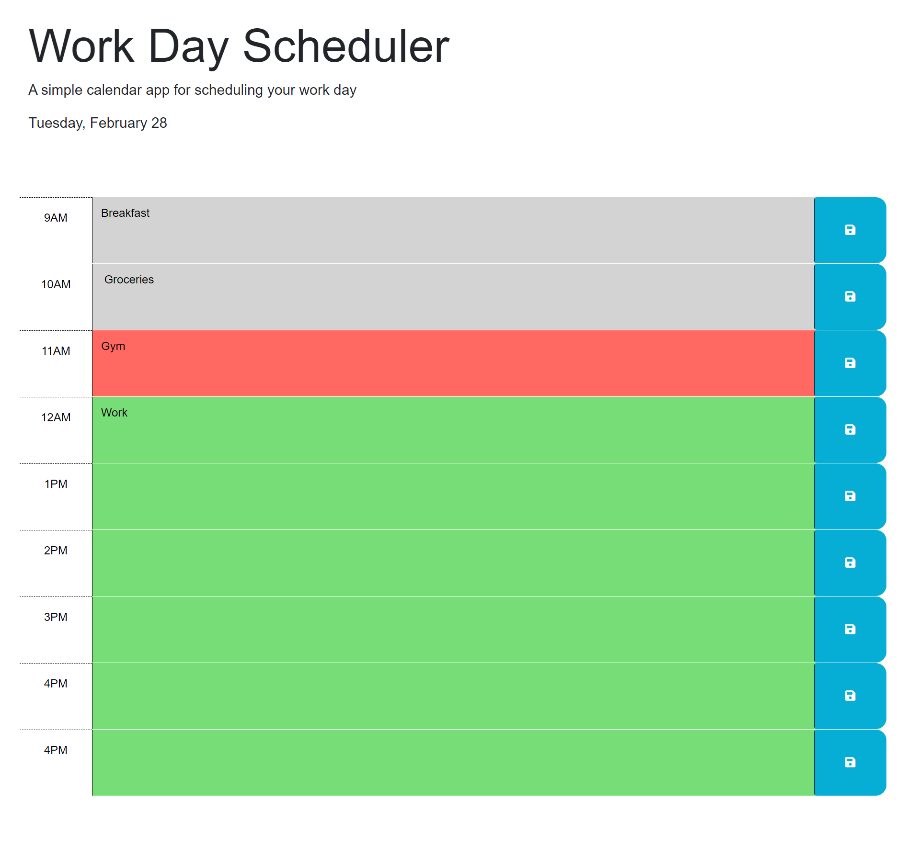

# <Web-Agenda>

## Description

This project was created in order to have a reliable daily planner.
- Everyone needs to sort out their life, why not start with a scheduler!
- During this project, I learned how to use Day.js to incorperate live hours into a project to be used to determine the current, past and future times.

## Usage

Link to Pages: 
[Web-Agenda](https://matthewstandish.github.io/web-agenda/ "Web-Agenda")

## Features

Writing a description in an hour block and saving it will save to the users local storage and will be retrieved on each reload.
